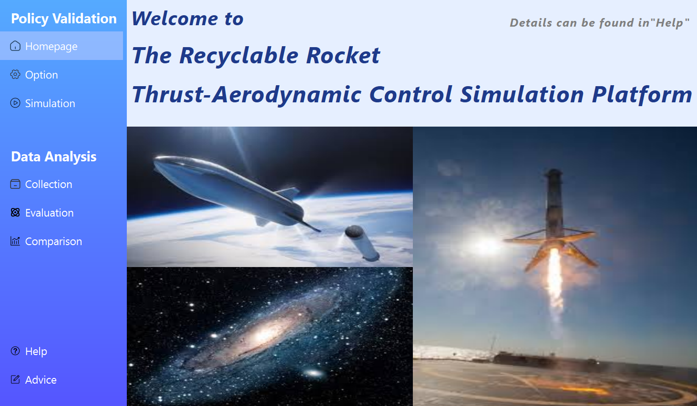
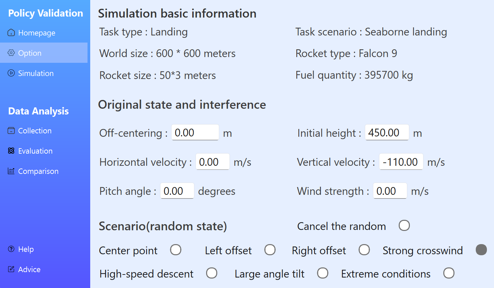
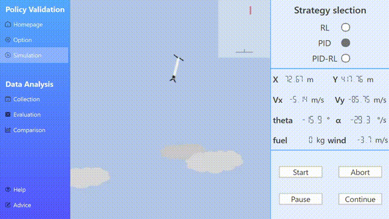
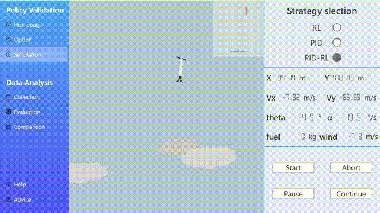
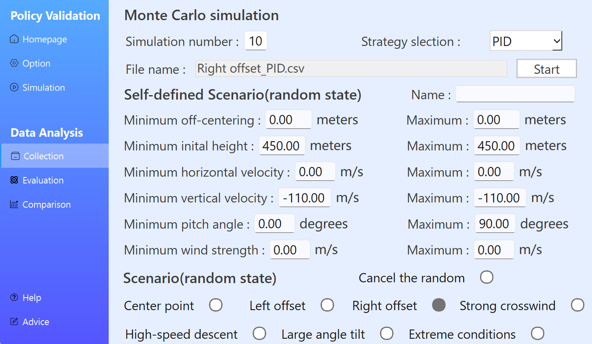
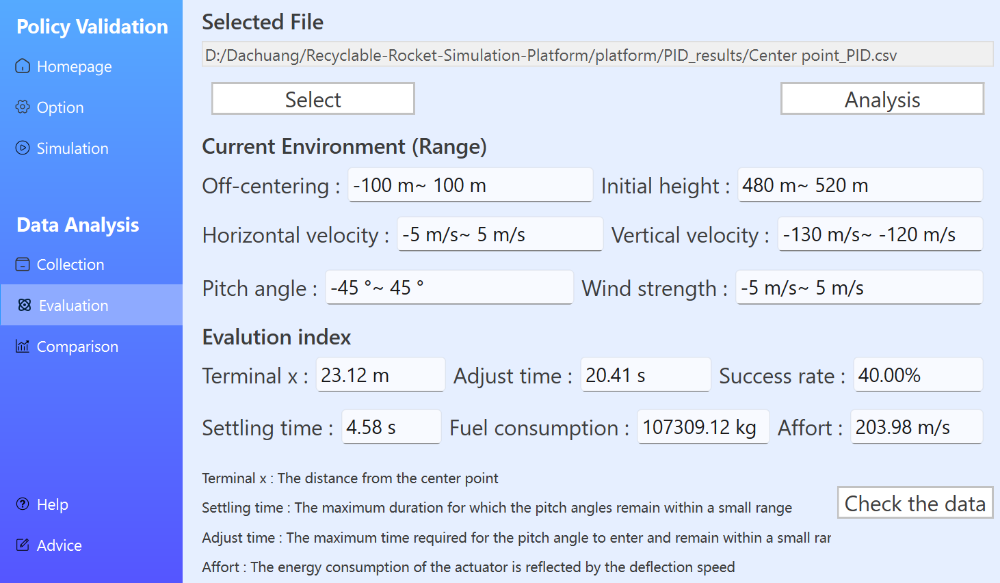
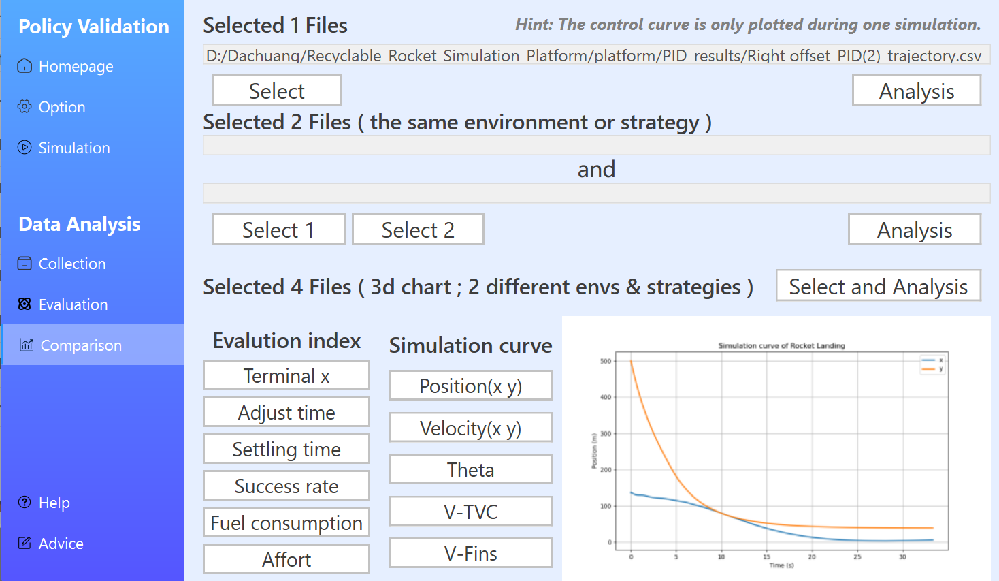
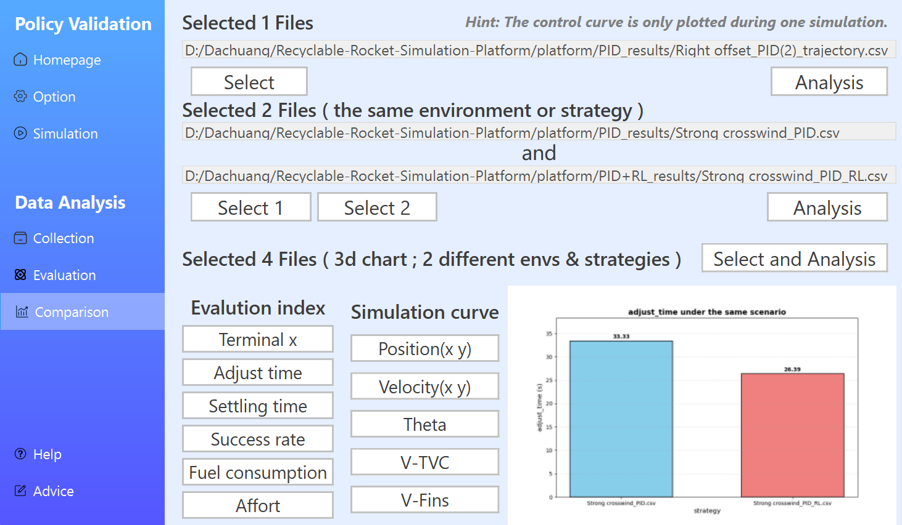

# 可回收火箭推力-气动复合控制仿真平台

<p align="left">

  
  
  
  
  
  
  
  
  
  
  
  
  

</p>

一个面向可回收运载火箭再入/着陆段的全流程可视化仿真平台，集成强化学习、经典PID以及混合控制策略，支持算法快速迭代、性能评估与动态演示。

## 📖 项目简介

本项目聚焦于**可视化仿真可回收火箭再入段与着陆段推力矢量与气动舵面协同控制过程**。  
针对纯PID控制在大扰动、非线性场景下鲁棒性不足，以及纯强化学习训练困难、可解释性差等痛点，我们提出并实现了**基于残差强化学习与PID的双层复合控制架构**。  

平台采用纯 Python 技术栈，从动力学建模、控制器设计、强化学习训练，到图形化交互与动画渲染，实现了全链路闭环仿真。所有代码、模型与评估工具均已开源。

## ✨ 核心特性

- **三种控制策略对比**  
  - 纯 PID（三环串级控制）  
  - 纯强化学习（A2C + PPO，课程学习）  
  - 残差强化学习 + PID 融合控制（RL‑PID，课程学习）

- **高动态环境建模**  
  - 二维 3-DOF 火箭动力学（参考猎鹰9号一子级）  
  - 栅格舵简化气动模型（舵偏‑升/阻力系数拟合）  
  - 多种测试场景：初始大倾角、强侧风、位置偏移、高速下落等

- **一体化仿真与评估**  
  - 单次动画仿真：实时渲染火箭姿态、轨迹与关键参数  
  - 蒙特卡洛批量测试：自定义仿真场景、收集飞行数据  
  - 六维评价体系：落点精度、成功率、收敛时间、稳定时间、燃料消耗、执行器能耗

- **图形化交互界面**  
  - 基于 `PySide6` 的前端，策略选择、参数配置“开箱即用”  
  - 评估分析模块支持数据采集、图表生成与多结果对比

## 🧠 算法架构

| 策略 | 说明 |
|------|------|
| **Pure RL** |  三步走：推力矢量基线 (A2C) → 舵面协同预训练 (A2C) → 残差微调 (PPO) |
| **Pure PID** | 三环串级：高度环 → 位置环 → 姿态环，基于动压占比的动态控制分配 |
| **RL + PID** | PID 作为稳定基线，PPO 网络输出高层补偿量，叠加到执行器指令 |

> 奖励函数中引入动压区域惩罚与执行器高频动作惩罚，引导智能体在高动压区域优先利用气动舵面，节省燃料并减少抖动。

## 📦 项目结构

```
├── platform/ # 核心源代码
│ ├── rocket/ # 火箭动力学与气动模型
│ ├── controller/ # PID、RL、RL+PID 控制器
│ ├── policy/ # 强化学习网络
│ ├── ckpt/ # 训练好的模型权重
│ ├── inference/ # 策略执行与验证
│ ├── rocket.ui/ # PySide6 图形界面
│ ├── montercarlo/ # 评估分析
│ ├── image/ # 图片资源
│ └── utils/ # 工具函数、可视化绑定
├── algorithm/ # 内置的三种控制算法
│ ├── RL
│ │ ├── RL_TVC/ # 仅推力矢量训练
│ │ ├── RL_TVC_Fin/ # 协同预训练
│ │ └── RL_Residual/ # 残差补偿协同训练
│ ├── PID/ # 级联控制
│ └── PID_RL
│ │ ├── PID_controller/ # 基线控制器
│ │ └── RL_Residual/ # 残差补偿训练
├── instruction/ # 用户手册
├── gallery/ # 平台界面
├── requirements.txt # Python 依赖
├── README.md
└── LICENSE
```

## 📊 平台演示

<table align="center">

<tr>

<td align="center" valign="top" width="50%">

<br>

<b>Simulation Platform Main UI</b><br>
<em>Figure 1</em>

</td>

<td align="center" valign="top" width="50%">

<br>

<b>Scenario Configuration Interface</b><br>
<em>Figure 2</em>

</td>

</tr>

</table>

<br>

<table align="center">

<tr>

<td align="center" valign="top" width="50%">

<br>

<b>PID Controller</b><br>
<em>Strong Crosswind Scenario · Figure 3</em>

</td>

<td align="center" valign="top" width="50%">

<br>

<b>PID + RL Composite Controller</b><br>
<em>Strong Crosswind Scenario · Figure 4</em>

</td>

</tr>

</table>

<br>

<table align="center">

<tr>

<td align="center" valign="top" width="50%">

<br>

<b>Monte Carlo Evaluation Settings</b><br>
<em>Figure 5</em>

</td>

<td align="center" valign="top" width="50%">

<br>

<b>Evaluation Data Interface</b><br>
<em>Figure 6</em>

</td>

</tr>

</table>

<br>

<table align="center">

<tr>

<td align="center" valign="top" width="50%">

<br>

<b>Simulation Curves</b><br>
<em>Position, Velocity , etc. · Figure 7</em>

</td>

<td align="center" valign="top" width="50%">

<br>

<b>Performance Metrics Comparison</b><br>
<em>Controller Evaluation Results · Figure 8</em>

</td>

</tr>

</table>

## 🔬 主要创新

- **可应用于火箭回收的残差式混合控制架构** – PID 守底，RL 补偿，兼顾稳定性与鲁棒性
- **课程学习训练范式** - 由易到难逐步开放扰动，提升收敛效率与泛化能力
- **轻量化工程实现** - 纯 Python 打造，无商业软件依赖，可编译为跨平台独立应用

## 📚 应用前景

- 航天器再入/着陆控制算法的快速验证与原型迭代 
- 飞行器控制与智能算法教学的数字化演示  
- 垂直起降无人机等飞行器多执行器耦合系统的技术迁移

## 🚧 后续计划

- 🚧 修复平台尚存的一些问题
- 🚧 完善部分算法与平台的接口
- [ ] 建立并分析栅格舵高保真模型
- [ ] 搭建火箭再入段飞行场景
- [ ] 聚焦火箭再入段（栅格舵）控制过程
- [ ] 研究并集成更多有效的控制算法
- [ ] 探究六自由度火箭控制

## 🙏 致谢

该项目中的某些想法和具体实施细节受到了以下开源项目的启发：

- [rocket-recycling](https://github.com/jiupinjia/rocket-recycling)

特别感谢原作者所付出的卓越努力以及所提供的开源贡献。

## 🚀 快速开始

### 环境要求

- Python 3.10+
- pip 依赖见 `requirements.txt`

### 安装

```bash
git clone https://github.com/ysx-xsy/Recyclable-Rocket-Simulation-Platform.git
cd Recyclable-Rocket-Simulation-Platform
pip install -r requirements.txt
```
> 平台使用说明及开源细节查看“instruction”

## 📚 引用

如果您认为此项目对您的研究有所帮助，请考虑引用下述文段：

```bibtex
@misc{recyclable_rocket_platform,
  author       = {Sy Xu},
  title        = {Recyclable Rocket Simulation Platform},
  year         = {2026},
  publisher    = {GitHub},
  journal      = {GitHub repository},
  howpublished = {\url{https://github.com/ysx-xsy/Recyclable-Rocket-Simulation-Platform}}
}
```

## 📄 许可证

This project is licensed under the MIT License.

See the [LICENSE](./LICENSE) file for details.
